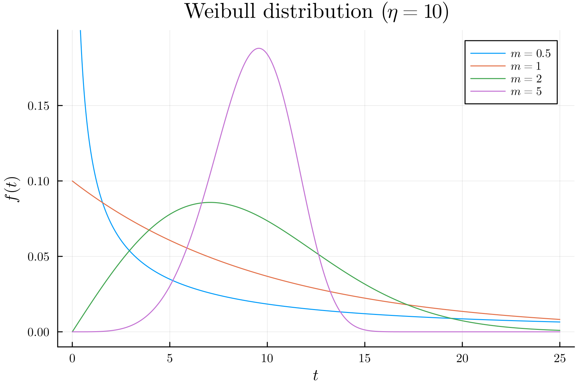

# Julia 忘備録  

Julia を使っていてエラーなどでつまずいたものの中で解決できたものをここに忘備録として記す.

## 目次

- [環境](#環境)
- [Error01 (2023/11/21)](#error01)

## 環境  

実行環境及びJuliaのバージョンは以下の通り.

`cmd` で `code --v` とすることで VScode のバージョンを確認.

```cmd
1.84.2
1a5daa3a0231a0fbba4f14db7ec463cf99d7768e
x64
```

Julia の`REPL`内で`versioninfo()`とすることで Julia のバージョンを確認. 

```julia
julia> versioninfo()
Julia Version 1.9.0
Commit 8e63055292 (2023-05-07 11:25 UTC)
Platform Info:
  OS: Windows (x86_64-w64-mingw32)
  CPU: 8 × 11th Gen Intel(R) Core(TM) i5-1155G7 @ 2.50GHz
  WORD_SIZE: 64
  LIBM: libopenlibm
  LLVM: libLLVM-14.0.6 (ORCJIT, tigerlake)
  Threads: 1 on 8 virtual cores
Environment:
  JULIA_EDITOR = code
  JULIA_NUM_THREADS =
```

### 総括

> VScode 1.84.2 (x64)  
> Julia Version 1.9.0

## Error01

### Q. 浮動小数点数を小数第２位表示にしたい.  

### A. 以下のように記述する.  

記述例  

```julia
x = 0.3499999
x_round = round(x, digits = 2)

println(x)
println(x_round)
```

実行結果  

```julia
0.3499999
0.35
```

## Error02

### Q. GRバックエンドでプロットした図にLaTeX表記を適用したい.

### A. LaTeXStringsパッケージとプロットスタイルの指定を併用する. 

ここでは, 例としてワイブル分布をプロットする.

ワイブル分布は,
$$f(t)=\dfrac{m}{\eta}\left(\dfrac{t}{\eta}\right)^{m-1}\exp \left\{-\left(\dfrac{t}{\eta}\right)^{m}\right\}$$
で表される確率分布を持つ.
なお, $m$は形状パラメータ, $\eta$は尺度パラメータである. 

ここで, 以下のように記述する.

```julia
using Plots
using LaTeXStrings

plot_font = "Computer Modern"
default(fontfamily=plot_font, linewidth=1, label=nothing, grid=true)

function f(t, m, η)
    return m ./ η .* (t ./ η) .^ (m .- 1) .* exp.(-(t ./ η) .^ m)
end

t = 0:0.01:25

plot(t, f.(t, 0.5, 10), xlabel=L"t", ylabel=L"f(t)", title="Weibull distribution (\$η=10\$)", ylims=(-0.01, 0.2), label=L"m=0.5")
plot!(t, f.(t, 1, 10), label=L"m=1")
plot!(t, f.(t, 2, 10), label=L"m=2")
plot!(t, f.(t, 5, 10), label=L"m=5")

savefig("weibull.png")

```

以下に実行例を示す. 


